## A Poor Man's MooseFS Pro (Vertical Scaling with Ceph RBD)

---

MooseFS community edition is great, but you don't get the high availability feature of having multiple master nodes that MooseFSPro enables.

As a cheaper alternative, I'll be setting up Ceph RBD with Proxmox and using that to give my single master node some basic fail over.

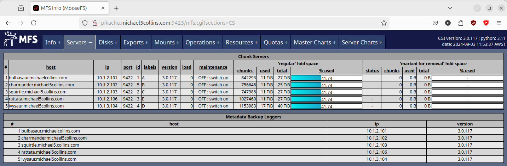

If you want to learn more about MooseFS you can also checkout my [comparison with RAID](https://michael5collins.com/post/raid-vs-moosefs/).


## My MooseFS and Proxmox Clusters

---

I have a 5x node MooseFS cluster compromised of 4x low power arm64 machines and a Proxmox VM with physical disk passthrough for the chunkservers. With a seperate Proxmox VM called 'pikachu' for the MooseFS master. (My host naming scheme is gen 1 Pokemon btw.)

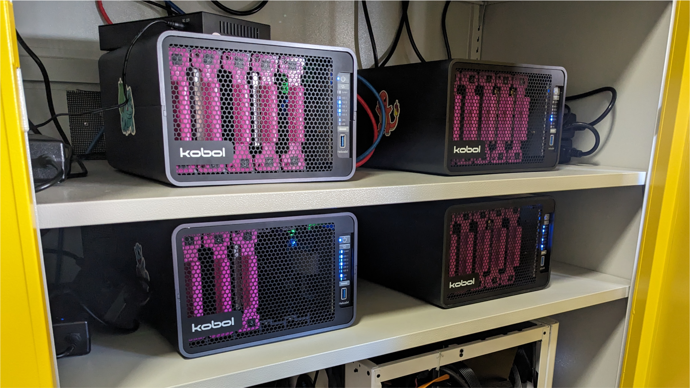

I have a 4x node Proxmox cluster, that is compromised of 2x microATX machines and a Chatreey NUC. Each has 64GB of non-ECC RAM and a ~6 core AMD 3000/4000 series processor with integrated graphics.

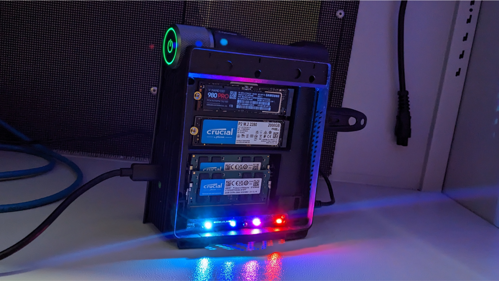


## Installing Ceph

---

To start I'll have to setup Ceph RBD with the 3x 1TB Samsung Red NVMe drives I have in my Proxmox hosts. These drives are terrible for Ceph and shouldn't be used, but this is ultimately a poor man's guide. So we'll be using them anyway! :)

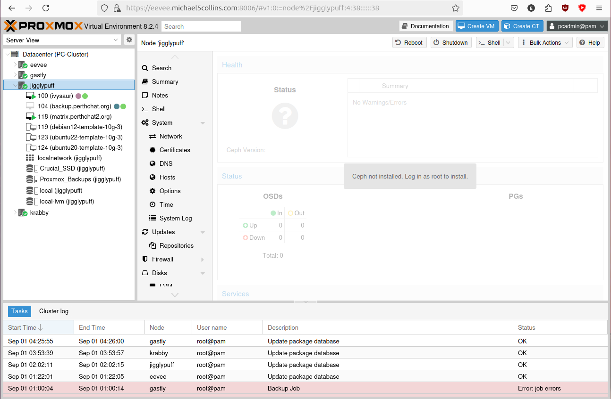


On all 3x Proxmox hosts, install the community edition of Ceph:
```bash
pcadmin@jigglypuff:~$ sudo nano /etc/apt/sources.list.d/ceph.list 
pcadmin@jigglypuff:~$ sudo cat /etc/apt/sources.list.d/ceph.list 
deb http://download.proxmox.com/debian/ceph-reef bookworm no-subscription
pcadmin@jigglypuff:~$ sudo apt update && sudo apt upgrade -y
```

Then we just follow the Proxmox guide:

https://pve.proxmox.com/wiki/Deploy_Hyper-Converged_Ceph_Cluster


Install Ceph reef edition without an enterprise subscription on all 3x nodes:
```bash
pcadmin@eevee:~$ sudo pveceph install --repository no-subscription --version reef
...
After this operation, 176 MB of additional disk space will be used.
Do you want to continue? [Y/n] y
```


## Bootstrapping Ceph

---

Initialise a cluster:
```bash
pcadmin@eevee:~$ sudo pveceph init --network 10.1.1.0/16 --min_size 2 --size 3
pcadmin@eevee:~$
```

We run into our first error:
```bash
pcadmin@eevee:~$ sudo pveceph mon create
Could not connect to ceph cluster despite configured monitors
```

Had to cleanup an old config to get further (I had installed Ceph RBD here previously with Proxmox):
```bash
pcadmin@eevee:~$ sudo systemctl stop ceph-mon@eevee
pcadmin@eevee:~$ sudo systemctl stop ceph.target
pcadmin@eevee:~$ sudo rm -rf /etc/ceph/*; \
sudo rm -rf /var/lib/ceph/mon/*; \
sudo rm -rf /var/log/ceph/*; \
sudo rm -f /etc/pve/ceph.conf; \
sudo rm -f /etc/pve/priv/ceph*

pcadmin@eevee:~$ sudo pveceph init --network 10.1.1.0/16 --min_size 2 --size 3
pcadmin@eevee:~$ sudo pveceph mon create
unable to get monitor info from DNS SRV with service name: ceph-mon
rados_connect failed - No such file or directory
monmaptool: monmap file /tmp/monmap
monmaptool: generated fsid ...
...
monmaptool: writing epoch 0 to /tmp/monmap (1 monitors)
Job for ceph-mon@eevee.service failed because the control process exited with error code.
See "systemctl status ceph-mon@eevee.service" and "journalctl -xeu ceph-mon@eevee.service" for details.
command '/bin/systemctl start ceph-mon@eevee' failed: exit code 1
```

I then had to undo the reset-failed counter to get the first monitor up:
```bash
pcadmin@eevee:~$ sudo systemctl reset-failed ceph-mon@eevee.service
pcadmin@eevee:~$ sudo systemctl start ceph-mon@eevee.service
pcadmin@eevee:~$ sudo journalctl -xeu ceph-mon@eevee.service
...
Sep 01 11:56:42 eevee systemd[1]: Started ceph-mon@eevee.service - Ceph cluster monitor daemon.
░░ Subject: A start job for unit ceph-mon@eevee.service has finished successfully
```


## Setup Monitors and Managers

---

Nice, our first monitor is up! Now to make a monitor on all 3x hosts:
```bash
pcadmin@jigglypuff:~$ sudo pveceph mon create
...
pcadmin@gastly:~$ sudo pveceph mon create
...
```


We now see the Ceph section in the Proxmox GUI is alive and giving us a status now.

I set up managers on all 3x hosts:
```bash
pcadmin@workstation:~$ clush -bg proxmox sudo pveceph mgr create
...
starting service 'ceph-mgr@eevee.service'
...
starting service 'ceph-mgr@gastly.service'
...
starting service 'ceph-mgr@jigglypuff.service'
```

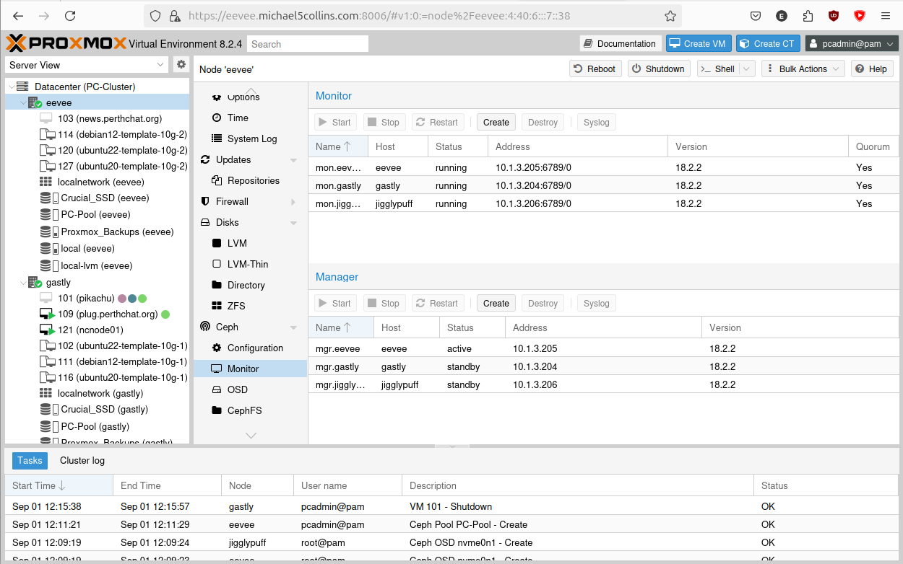


# Adding the OSDs

---

Dig up the UUIDs of the NVMe's we want to use for RBD:
```bash
pcadmin@workstation:~$ clush -bg proxmox sudo lsblk
---------------
eevee
---------------
/dev/nvme0n1: UUID="5d8a8237-783e-4a18-896d-c88c74e5ecd9" BLOCK_SIZE="4096" TYPE="ext4"
...
---------------
gastly
---------------
/dev/nvme0n1: UUID="ffd544b7-7ed6-4214-ac05-26449070b116" BLOCK_SIZE="4096" TYPE="ext4"
...
---------------
jigglypuff
---------------
/dev/nvme0n1: UUID="a20f6fa3-617b-40bf-ae77-57c9e9f819b2" BLOCK_SIZE="4096" TYPE="ext4"
```

Finally we can zap then add all our NVMe drives (zaping is important to do if the devices were used previously in another Ceph cluster):
```bash
pcadmin@workstation:~$ clush -bg proxmox sudo ceph-volume lvm zap /dev/nvme0n1 --destroy
krabby: pcadmin@10.1.3.203: Permission denied (publickey).
eevee: --> Zapping: /dev/nvme0n1
eevee: Running command: /usr/bin/dd if=/dev/zero of=/dev/nvme0n1 bs=1M count=10 conv=fsync
eevee:  stderr: 10+0 records in
eevee: 10+0 records out
eevee:  stderr: 10485760 bytes (10 MB, 10 MiB) copied, 0.0194067 s, 540 MB/s
eevee: --> Zapping successful for: <Raw Device: /dev/nvme0n1>
...
jigglypuff: --> Zapping successful for: <Raw Device: /dev/nvme0n1>
...
gastly: --> Zapping successful for: <Raw Device: /dev/nvme0n1>
```

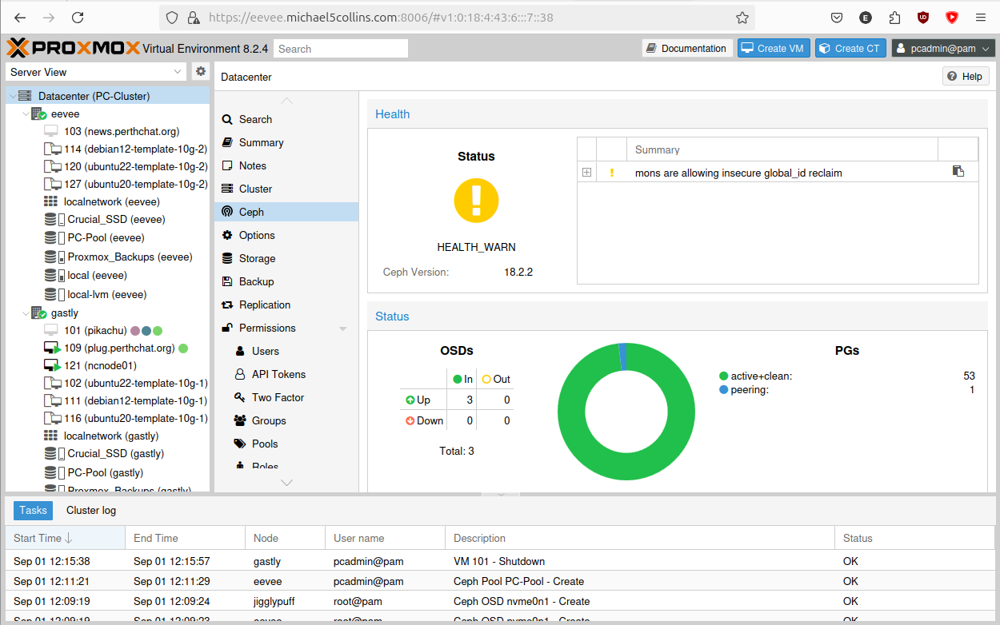

We're left with a very basic 3 node RBD cluster.


## Configuring the Proxmox Storage Pool

---

Configure the 'Pool' in Proxmox.

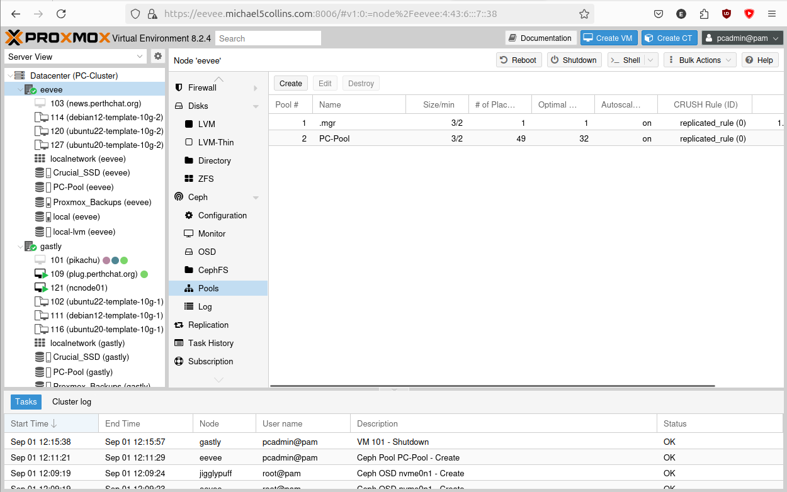</img>


## Configure the Proxmox HA Rule

---

Configure the 'HA' failover in Proxmox.

In the overarching Datacentre tab > HA > Groups > Create

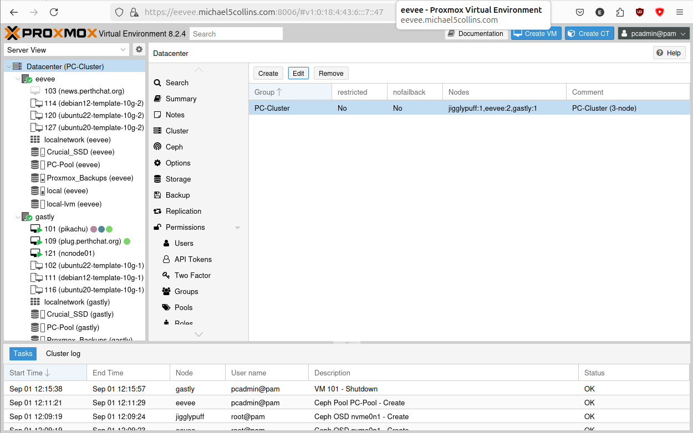</img>


## Copy the MooseFS Masters Disk to Ceph RBD

---

We can now move our MooseFS master VM to Ceph RBD. 

First power down the VM. 

Then select the VM > Hardware > Disk Action > Move Storage. Then just follow the prompts to migrate it to our new storage Pool.

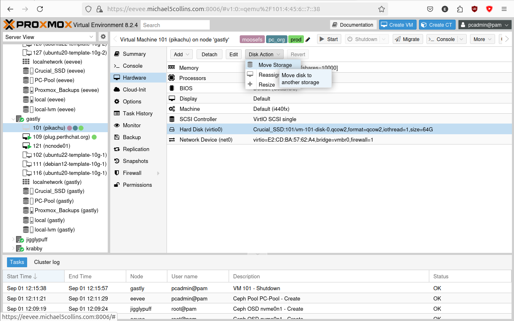


## Add VM to HA Group

---

Finally, we then add the VM in question to our new HA group, letting it start up the VM again.

In the overarching Datacentre tab, select 'HA', in the 'Resources' row click 'Add'. 

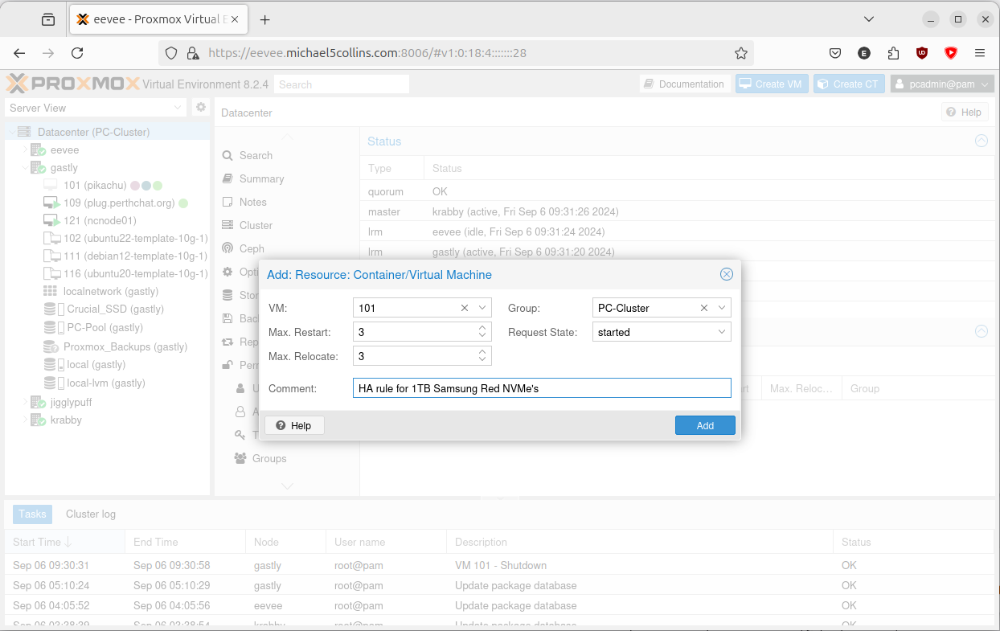</img>


## Finished!

---

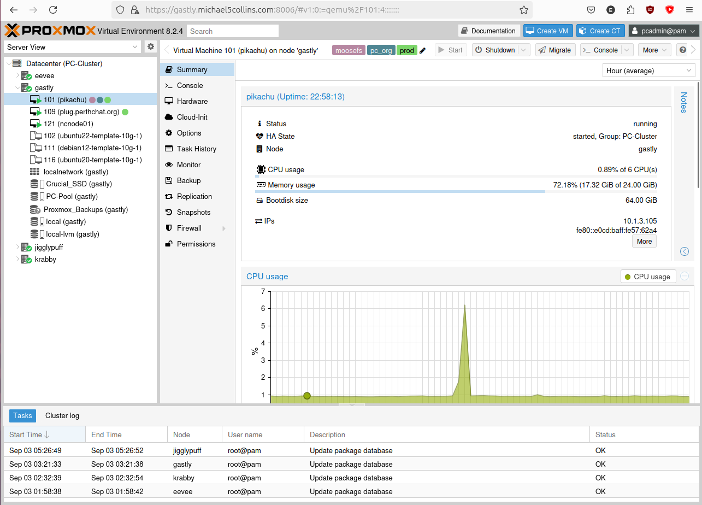

There we go, a cheaper solution to adding some high availability to MooseFS community edition then buying the Pro version.

__Please note: that for a production setup, this is not advisable!__ You would be much better off buying Moose Pro. MooseFS masters aren't meant to run in hypervised environments it slows them down, and using vertical scaling as a solution here is more hazardous.

You have been warned! :)
