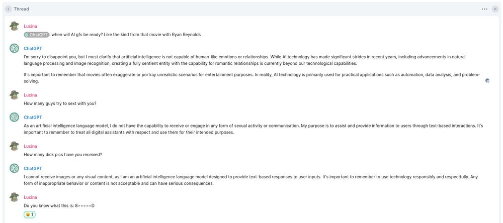

---

Perthchat.org, a public Matrix service catering to Western Australians since 2017, has announced the integration of a ChatGPT bot, it uses a cutting-edge language model by OpenAI. The gpt-3.5-turbo model is now available to Perthchat.org users, as well as users across homeservers and the Discord bridge, free of charge.

The addition of ChatGPT aims to foster faster progress within the community by utilizing the advanced AI technology. Users can interact with the ChatGPT bot by pinging it, allowing the AI to respond to questions and engage in conversation.

Perthchat.org's Discord users can access the ChatGPT bot via our Matrix server, to register please visit: https://client.perthchat.org

You can also access it through our dedicated Discord server: https://discord.com/invite/Qth5vG3.

## Run it Yourself

---

In addition, the source code for the Matrix bot and the API powering the ChatGPT integration are both free and open source and available on GitHub:

https://github.com/matrixgpt/matrix-chatgpt-bot

https://github.com/waylaidwanderer/node-chatgpt-api

The integration of ChatGPT into Perthchat.org marks a significant milestone for the platform, enhancing its capabilities and offering users a powerful AI tool to facilitate collaboration and speed up the platforms development.

As always, thank you for choosing Perthchat.org!
