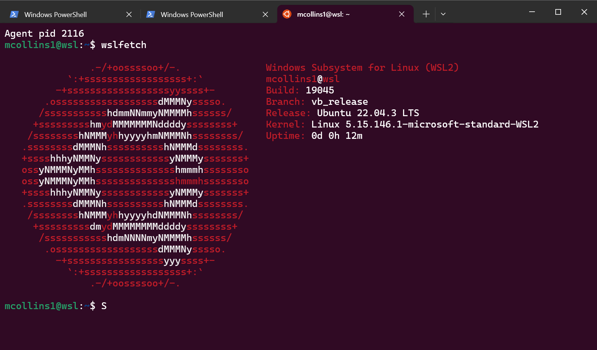

## Linux Administration on Windows

---

Since venturing into Linux administration, Ubuntu has always been my daily driver. It's minimal, can run on very little RAM and seems to 'just work' when doing various administrative tasks.

However, for my new job I was handed a Windows 10 machine, I was suddenly caught up in a new environment with none of the tools I was used to. I had never even connected to a remote server off a Windows machine before. My initial experience was frustrating and I had to spend a while learning how to get things going.

This article summarises what I've learnt and how I was able to configure my Windows machine to make it as smooth as possible.


## Multiple Tabbed Terminal

---

Windows CommandPrompt and Powershell do not support multiple tabs, for veteran command line users this simply won't do. Thankfully Microsoft has published a decent Terminal application which does support multiple tabs.

Install the 'Terminal' app from the Microsoft store: https://apps.microsoft.com/detail/9n0dx20hk701


## Agent Forwarding Troubles

---

Out of the box SSH forwarding seems to be broken on Windows 10 and 11, you'll keep seeing errors like this:

`channel 1: chan_shutdown_read: shutdown() failed for fd 7 [i0 o0]: Not a socket`


To fix this you need to install the beta version of OpenSSH:
```
PS C:\Users\mcollins1> winget install -e --id Microsoft.OpenSSH.Beta
```


## Adding Git

---

Surprisingly Git is not installed by default with Windows 10, to install it run:
```
PS C:\Users\mcollins1> winget install -e --id Git.Git
```


## Git and Linux Line Endings

---

Without any extra configuration, Git on Windows will replace the Linux line endings on your files. This will break any scripts that you're trying to run on a Linux machine, requiring you to manually run 'dos2unix' against them.

Luckily, Git can be configured not to perform these automatic conversions and to always use Linux line endings:
```
PS C:\Users\mcollins1> git config --global core.autocrlf false
PS C:\Users\mcollins1> git config --global core.eol lf
```


## Visual Studio and Linux Line Endings

---

By default, Visual Studio will also save edited files with Windows line endings. To prevent Visual Studio from doing this, we can adjust its settings to make sure that it also uses Linux line endings. Go:

File > Preferences > Settings

Text Editor > Files > Eol

Select '\n' for Linux line endings.


## SSH Agent Startup

---

SSH Agent sometimes won't be set to start automatically with Windows, start and enable this like so:
```
PS C:\Users\mcollins1> Start-Service -Name ssh-agent
PS C:\Users\mcollins1> Get-Service -Name ssh-agent | Set-Service -StartupType Automatic
```

You can then add and list your SSH key:
```
PS C:\Users\mcollins1> ssh-add C:\Users\mcollins1\.ssh\pawsey_ed25519
PS C:\Users\mcollins1> ssh-add -l
256 SHA256:aB7+ezx4eKSlJ/NJGiw3/dR7vVPVHmZbMQSiUhk3BwY Michael Collins 2024 - michael.collins@pawsey.org.au (ED25519)
```


## Git Without Password Prompts

---

Despite having an SSH identity saved to the SSH Agent, Git will not actually use it:
```
PS C:\Users\mcollins1\repos> ssh-add -l
256 SHA256:aB7+ezx4eKSlJ/NJGiw3/dR7vVPVHmZbMQSiUhk3BwY Michael Collins 2024 - michael.collins@pawsey.org.au (ED25519)
PS C:\Users\mcollins1\repos> git clone ssh://git@bitbucket.pawsey.org.au:7999/aos/acacia-ansible.git
Cloning into 'acacia-ansible'...
Enter passphrase for key '/c/Users/mcollins1/.ssh/pawsey_2024':
```

To fix this, we need to configure Git to use the same OpenSSH client that Terminal and SSH-Agent are using:
```
PS C:\Users\mcollins1\repos> git config --global core.sshCommand "C:/Windows/System32/OpenSSH/ssh.exe"
PS C:\Users\mcollins1\Repos> git clone ssh://git@bitbucket.pawsey.org.au:7999/aos/acacia-ansible.git
Cloning into 'acacia-ansible'...
remote: Enumerating objects: 201, done.
remote: Counting objects: 100% (201/201), done.
remote: Compressing objects: 100% (158/158), done.
remote: Total 201 (delta 85), reused 0 (delta 0), pack-reused 0
Receiving objects: 100% (201/201), 27.82 KiB | 4.64 MiB/s, done.
Resolving deltas: 100% (85/85), done.
```


## For Everything Else There's WSL

---

For Bash and all the other Linux tools I like to run locally, there's WSL:
```
PS C:\Users\mcollins1> wsl.exe --install Ubuntu
```

The 'Terminal' application we installed above can also be used to open WSL in multiple tabs.

After booting the Ubuntu instance, I change the hostname and mount the Windows home directory to ~/win/:
```
mcollins1@wsl:~$ sudo hostnamectl set-hostname wsl
mcollins1@wsl:~$ ln -s /mnt/c/Users/mcollins1 ~/win
mcollins1@wsl:~$ sudo nano /etc/wsl.conf
...

[boot]
systemd=true

[automount]
enabled = true
root = /mnt/
options = "metadata,umask=22,fmask=11"

[network]
hostname = wsl
generateHosts = true
generateResolvConf = true

[interop]
enabled = true
appendWindowsPath = true

mcollins1@wsl:~$ sudo reboot
```

I then add a section to .bashrc to start the SSH agent up each time I access WSL:
```
mcollins1@wsl:~$ nano ~/.bashrc
...
# Start SSH agent
if [ -z "$SSH_AUTH_SOCK" ]; then
    if [ -f "$HOME/.ssh/agent_socket" ]; then
        export SSH_AUTH_SOCK="$HOME/.ssh/agent_socket"
    else
        rm -f "$HOME/.ssh/agent_socket"
        eval "$(ssh-agent -a "$HOME/.ssh/agent_socket")"
        ssh-add
    fi
fi
```

Then finally, I add my SSH identity to WSL too:
```
mcollins1@wsl:~$ ssh-add ~/.ssh/pawsey_2024
Enter passphrase for /home/mcollins1/.ssh/pawsey_2024:
Identity added: /home/mcollins1/.ssh/pawsey_2024 (Michael Collins 2024 - michael.collins@pawsey.org.au)
```

Home, sweet home!

