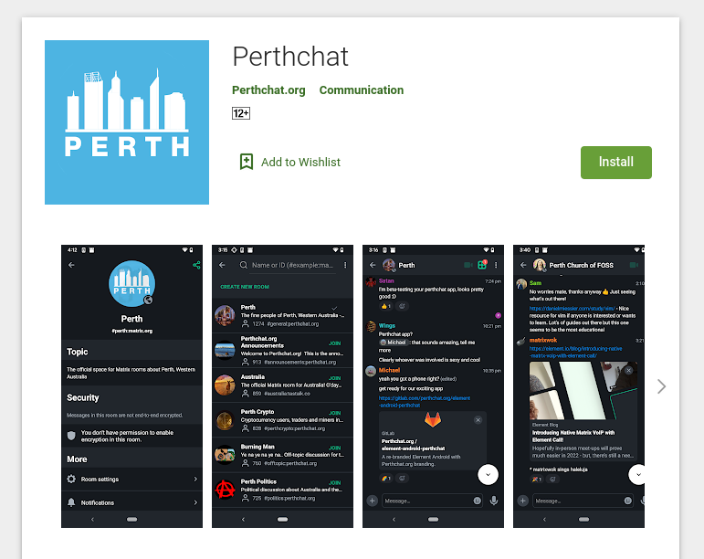

Today we’re proud to announce an expansion to Perthchat’s service, our new Android application!

This feature rich Matrix client is a fork of the popular [Element Android](https://github.com/vector-im/element-android/) client that’s been re-branded with our logo and name. It was created as a promotional tool to help grow the service. The source code of our app can be found [here](https://gitlab.com/perthchat.org/element-android-perthchat), we’ve also published the [compilation tool](https://gitlab.com/perthchat.org/compile-matrix-clients) we use for compiling (creating) the app.



Perthchat was started in 2017 and is one of the larger Matrix instances in Australia. This service was created to provide a secure, open source and ad-free messaging experience. The service is non-commercial and run by volunteers from the community.

Matrix itself is an open protocol and Matrix servers are federated just like email. This allows users to make friends and join rooms with people from other servers located all over the world. It also features secure end-to-end encryption, voice/video calling, bridging, bots, and more!

~~The Perthchat application is now available for download on the Play Store.~~

~~We also have a GAPPS-free Fdroid version that’s available for download here.~~

---


## Is this an April Fool’s Day joke?

No, this new app just happened to be released on April 1st… we swear!

---


# Verifying the FDroid Download

The more security conscious users might be wondering how they can trust the .apk download we’ve provided, you can use the apksigner tool to verify our upload signature.

First download the latest version of [Android build-tools](https://developer.android.com/studio/releases/build-tools).

Then using the following command, print the certificate checksums for the .apk you downloaded:
```
$ apksigner verify --verbose --print-certs perthchat-fdroid-arm64-v8a-release.apk
...
Number of signers: 1
Signer #1 certificate DN: CN=Michael Collins, OU=Perthchat.org, O=PERTHCHAT.ORG INC, L=Perth, ST=Western Australia, C=AU
Signer #1 certificate SHA-256 digest: 8b4a25dcf5bb1a45375ccb2c284811d2cdf6bf48e7806072b984f2fb291467ed
Signer #1 certificate SHA-1 digest: 1ec3defc9f07ba7defbc62be8a98111688c262bc
Signer #1 certificate MD5 digest: eec6d69a194c22c310c7f8109c397100
Signer #1 key algorithm: RSA
Signer #1 key size (bits): 4096
Signer #1 public key SHA-256 digest: 4ad2aa753e96e619806d5500ce5e73f95d08db8bcc3a9e82f3e284711b0a7bfc
Signer #1 public key SHA-1 digest: f2b809115eb98ad1341e930855e8d0569843f732
Signer #1 public key MD5 digest: c57a25a69257bfcd38d53915281445ac
...
```

If the digest values you see are the same listed here, you can be sure the download is authentic.---


## You’re Australian! Isn’t this app going to be backdoored because of Access Laws?

Contrary to popular belief ‘[Assistance and Access](https://www.legislation.gov.au/Details/C2018A00148)’ laws do not permit the required creation of systemic weaknesses or backdoors:

<i>“317ZG	Designated communications provider must not be requested or required to implement or build a systemic weakness or systemic vulnerability etc.”</i>

In fact Assistance and Access laws only allow for a warranted and targeted attack against a specific users device.

**Caution: the following section is speculation and should be taken with a grain of salt.**

As the application publisher, I don’t have the ability to target a specific users device to intercept their end-to-end encrypted messages. A mechanism to do that doesn’t exist in the Element Android source code we copied. The application you download is the same signed .apk file everyone else receives. Although this capacity could be engineered, it would be a lot of effort that would need to be replicated in secret every time someone forks this client software.

With this in mind, a mechanism used to circumvent end-to-end encrypted messages on mobile devices would be provided more easily by Google and Apple. They control your device remotely and with their assistance encrypted messages could be intercepted at the operating system level. It’s possible that this was occurring before Access Laws were even created, and that these laws merely shed light on what is already happening.

Free and Open Source Software advocate Naomi Wu noted [that 3rd party (or even the default) Android keyboard software would be an excellent way to intercept encrypted messages sent from mobile apps.](https://twitter.com/realsexycyborg/status/1197695368105824256)

If you want protection from these laws (i.e., ultimate security), I don’t believe there is anything you can download from the Play Store / App Store that will provide this. That being said for the 99% of users who aren’t being targeted in this way, end-to-end encryption does provide meaningful protection for your communications and is certainly worth adopting.
