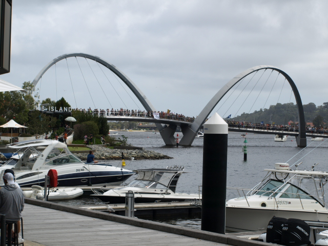



**Disclaimer: We are not confirming the claims of anyone interviewed in this video.**

This Saturday's vaccine mandate protest saw over a thousand people attend, a considerably higher turnout than previous protests held elsewhere under lockdown conditions. The Perth event, as part of a national set of rallies, began in Forrest Place in the Central Business District; then the attendants marched down to Elizabeth Quay and back.

The protests were against COVID vaccine mandates required to travel into WA, as well as mandates in industries such as healthcare, mining, construction.

There was a diverse crowd of attendees, from parents and workers in affected industries, to vaccine critics and lockdown opponents, even a small counter-rally of health industry workers was seen. Some expressed specific support for vaccination and health science, but were united with the crowd against coercion and violation of bodily autonomy.

On current numbers, most Australians over 16 are fully vaccinated against COVID-19 in every state and territory, as mentioned in ABC's report of the event:
https://www.abc.net.au/news/2021-10-16/wa-covid-protest-perth-forrest-place-anti-vaccines/100545066

The event seemed peaceful and there were no conflicts with the Police.

