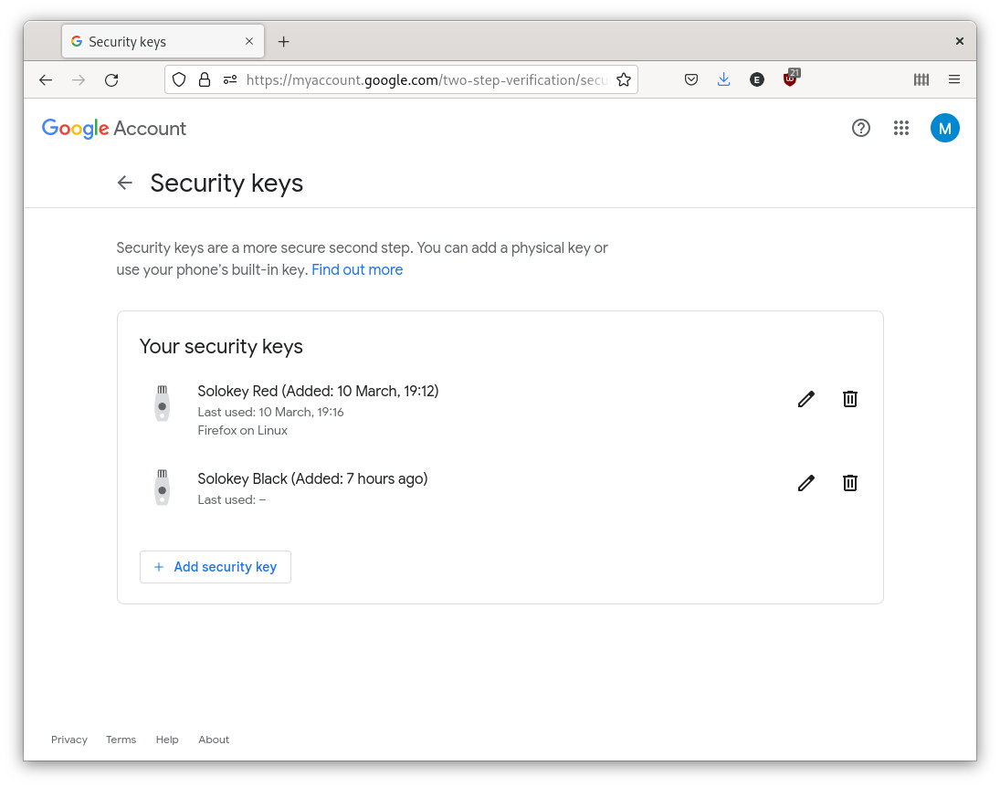
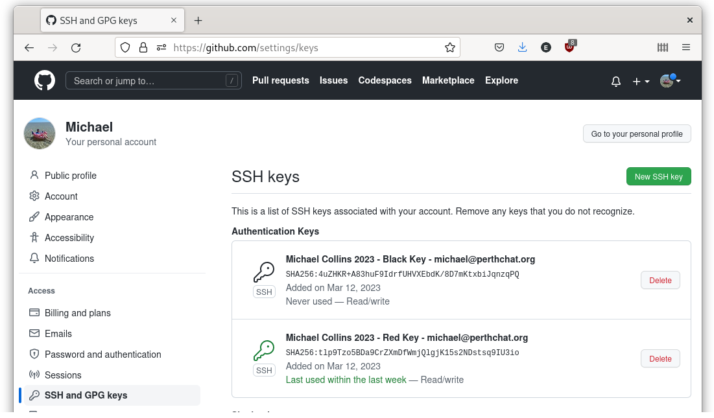

As my own security requirements have risen, I've needed a way to bolster the security of my accounts and other keys. One of the most effective ways to achieve this is by using a Universal 2nd Factor (U2F) security key. In this article, we'll explore the advantages of U2F security keys over traditional OTP and text 2FA, along with my personal experience of securing my online accounts and computer systems using Solokey v1 U2F devices.


## What is a U2F Security Key?

---

A U2F security key is a physical device that is used for two-factor authentication (2FA) and multi-factor authentication (MFA). It works by requiring users to insert the key into a USB port and touch the button on the key to authenticate themselves. U2F is an open standard developed by the FIDO Alliance, which is a non-profit organization dedicated to reducing the reliance on passwords for online authentication.

Compared to traditional OTP and text 2FA, U2F security keys provide a higher level of security. OTPs and text 2FA are vulnerable to phishing attacks, where attackers can trick users into providing their login credentials. With U2F, the user's private key never leaves the device, making it virtually impossible for attackers to gain access to their accounts unless the physical security of the key is compromised.


## Securing Online Accounts with U2F

---

After purchasing a couple of Solokey v1 devices. The first step was to set up U2F authentication for my Google, Facebook, PayPal, and email accounts. This process involved registering the SoloKey as a security key on each account and then inserting the key and pressing the button to authenticate myself. With each account I'm also making sure to register my backup Solokey as well, this allows me to not loose access if one of my Solokeys is lost.

Using U2F authentication was an easy and quick experience. Instead of having to type in a code or wait for a text message, all I had to do was insert the key and press the button. It is a relief to know that my more critical online accounts are now much more secure than before.




## Solokey Setup (Linux only)

---

**First install prerequisite packages:**
```
$ sudo apt install git llvm clang libclang-dev gcc-arm-none-eabi gdb-arm-none-eabi libc6-dev-i386
```

**Then connect your Solokeys and add a pin then update them one by one:**
```
$ solo key update
Wrote temporary copy of firmware-4.1.5.json to /tmp/tmp3qnvhtlp.json
sha256sums coincide: f36bb365bfddf75004f28af392ae1439192ca0ed821ef49429675a00d05087a
using signature version >2.5.3
erasing firmware...
updated firmware 100%             
time: 9.25 s
bootloader is verifying signature...
...pass!

Congratulations, your key was updated to the latest firmware version: 4.1.5

pcadmin@workstation:~/$ solo key set-pin
Please enter new pin: 
Please confirm new pin: 
Done. Please use new pin to verify key
```


## Securing Server Access and GitHub/GitLab Commits with U2F

---

As a software developer, I also needed to up the security of my server access and GitHub/GitLab commits. With U2F, I could achieve this effortlessly by using the key with SSH. I set up my SSH client to require U2F authentication and then registered the SoloKey as a security key on my server and GitHub/GitLab accounts. Whenever I needed to log in to my server or make a commit, I would insert the key and press the button to authenticate myself.

Using U2F authentication for server access and GitHub/GitLab commits added an extra layer of security to my development workflow. It prevented anyone who might have stolen my SSH key or GitHub/GitLab credentials from accessing my accounts.

**Generating the SSH key requires the `-O resident` flag to ensure the credential is discoverable:**
```
$ ssh-keygen -t ed25519-sk -O resident -f ~/.ssh/michael2023-red -C "Michael Collins 2023 - Red Key - michael@perthchat.org"
```

**If done properly you can check the new openssh credential on your solokey:**
```
$  solo key credential ls
PIN: 
Relying Party       Username            Credential ID
-----------------------------------------------------
ssh:                openssh             qPxzGbiMX5uvJOSWnDkvMGQgqhkiNIKvK5dI4XogHQG8ZuMGEOihYhFZYP4ewiPmUpyfS26AIA3LXlwyHIrx4rG/LwEAAA==
```




## Securing My GNOME Desktop with U2F

---

Using U2F authentication for my GNOME desktop provides an additional layer of security that goes beyond a traditional password. Even if someone were to obtain my password, they would still need physical access to my U2F security key to gain access to my system. Your U2F device can also be used to replace a traditional password for extra ease-of-use, although this is not as secure.

After installing the libpam-u2f package, I registered the SoloKey as a security key on my system and then configured PAM to require U2F authentication for login and sudo access. Now, whenever I log in to my GNOME desktop or run a sudo command, I have to insert the key and press the button to authenticate myself.

To configure, just install libpam-u2f and add a pam_u2f.so entry with either 'required' or 'sufficient' infront of the `@include common-auth` line:
```
$ sudo apt install libpam-u2f -y
$ cat /etc/pam.d/gdm-password 
#%PAM-1.0
auth    requisite       pam_nologin.so
auth	required	pam_succeed_if.so user != root quiet_success
auth    required        pam_u2f.so
@include common-auth
auth    optional        pam_gnome_keyring.so
...
```

The 'required' setting here adds security by requiring the U2F key as a 2FA to your GNOME keyring password. If you're device is in a safe location you could set it to 'sufficient' for convenience, this means that only inserting then pressing the button on your U2F key is required to login to the device.

You can also add U2F security to your sudo via these PAM files, here we can see I've chosen convenience over security and have set the U2F key as 'sufficient', so I no longer need to bother typing my sudo password:
```
$ cat /etc/pam.d/sudo
#%PAM-1.0

# Set up user limits from /etc/security/limits.conf.
session    required   pam_limits.so

auth    sufficient      pam_u2f.so
@include common-auth
@include common-account
@include common-session-noninteractive
```


## Conclusion

---

Overall I'm pretty happy with my Solokey v1 devices, they are affordable and more importantly reputable due to having both open-source hardware and software. I'm also looking forward to the release of the [new SoloKey v2](https://www.kickstarter.com/projects/conorpatrick/solo-v2-safety-net-against-phishing), it apparently has NFC, reversible USB-A and a more secure and open source friendly microcontroller:

*There are a lot of secure microcontrollers out there, but very few that can be used for open source projects. Our LPC55S69 is one of the latest by NXP and doesn't require a thicket of NDAs. It supports secure boot, TrustZone, asymmetric crypto acceleration (ECC, RSA), PUF, and filesystem encryption. Together, these features enable a high level of security, secure firmware updates, speedy operations, and passive NFC operation.*

I would recommend investing in a U2F security key and using it to secure your online accounts, server access, and computer systems. It may require a bit of initial setup, but it is well worth it if your organisation requires the extra security or ease-of-use that U2F can provide.