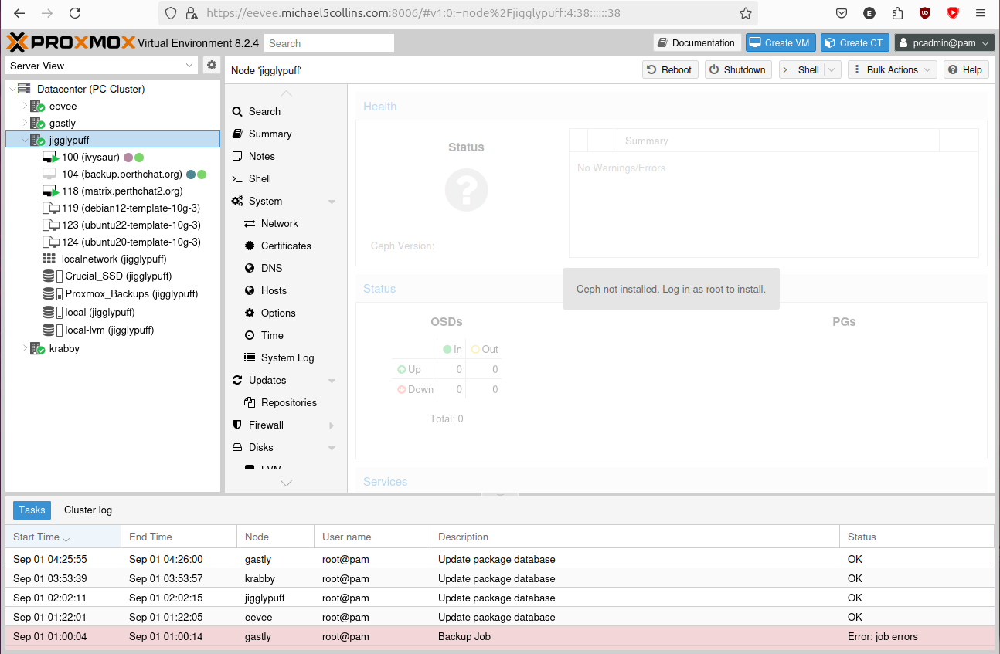

## Vertical Scaling with Ceph RBD, a Poor Man's MooseFSPro

---

MooseFS community edition is great, but you don't get the high availability feature of having multiple master nodes that MooseFSPro enables.

As a cheaper alternative, I'll be setting up Ceph RBD with Proxmox and using that to give my single master node some basic fail over.

[My humble little MooseFS cluster.](./moosefs-community-edition.png)

If you want to learn more about MooseFS you can also checkout my [comparison with RAID](https://michael5collins.com/post/raid-vs-moosefs/).


## My MooseFS and Proxmox Clusters

---

I have a 5x node MooseFS cluster compromised of 4x low power arm64 machines and a Proxmox VM with physical disk passthrough for the chunkservers. With a seperate Proxmox VM called 'pikachu' for the MooseFS master. (All my MooseFS and Proxmox hosts have Pokemon names btw, sorry if that's annoying.)

*** need a pick of helios64 bays

I have a 4x node Proxmox cluster, that is compromised of 2x microATX machines and a Chatreey NUC. Each has 64GB of non-ECC RAM and a ~6 core AMD 3000/4000 series processor with integrated graphics.

*** pick of eevee perhaps


## Installing Ceph

---

To start I'll have to setup Ceph RBD with the 3x 1TB Samsung Red NVMe drives I have in my Proxmox hosts. These drives are terrible for Ceph and shouldn't be used, but this is ultimately a poor man's guide. So we'll be using them anyway! :)




On all 3x Proxmox hosts, install the community edition of Ceph:
```
pcadmin@jigglypuff:~$ sudo nano /etc/apt/sources.list.d/ceph.list 
pcadmin@jigglypuff:~$ sudo cat /etc/apt/sources.list.d/ceph.list 
deb http://download.proxmox.com/debian/ceph-reef bookworm no-subscription
pcadmin@jigglypuff:~$ sudo apt update && sudo apt upgrade -y
```

Then we just follow the Proxmox guide:

https://pve.proxmox.com/wiki/Deploy_Hyper-Converged_Ceph_Cluster


Install Ceph reef edition without an enterprise subscription on all 3x nodes:
```
pcadmin@eevee:~$ sudo pveceph install --repository no-subscription --version reef
...
After this operation, 176 MB of additional disk space will be used.
Do you want to continue? [Y/n] y
```


## Bootstrapping Ceph

---

Initialise a cluster:
```
pcadmin@eevee:~$ sudo pveceph init --network 10.1.1.0/16 --min_size 2 --size 3
pcadmin@eevee:~$
```

We run into our first error:
```
pcadmin@eevee:~$ sudo pveceph mon create
Could not connect to ceph cluster despite configured monitors
```

Had to cleanup old config to get further (I had installed Ceph RBD here before with Proxmox):
```
pcadmin@eevee:~$ sudo systemctl stop ceph-mon@eevee
pcadmin@eevee:~$ sudo systemctl stop ceph.target
pcadmin@eevee:~$ sudo rm -rf /etc/ceph/*; \
sudo rm -rf /var/lib/ceph/mon/*; \
sudo rm -rf /var/log/ceph/*; \
sudo rm -f /etc/pve/ceph.conf; \
sudo rm -f /etc/pve/priv/ceph*

pcadmin@eevee:~$ sudo pveceph init --network 10.1.1.0/16 --min_size 2 --size 3
pcadmin@eevee:~$ sudo pveceph mon create
unable to get monitor info from DNS SRV with service name: ceph-mon
rados_connect failed - No such file or directory
monmaptool: monmap file /tmp/monmap
monmaptool: generated fsid ...
...
monmaptool: writing epoch 0 to /tmp/monmap (1 monitors)
Job for ceph-mon@eevee.service failed because the control process exited with error code.
See "systemctl status ceph-mon@eevee.service" and "journalctl -xeu ceph-mon@eevee.service" for details.
command '/bin/systemctl start ceph-mon@eevee' failed: exit code 1
```

I then had to undo the reset-failed counter to get the first monitor up:
```
pcadmin@eevee:~$ sudo systemctl reset-failed ceph-mon@eevee.service
pcadmin@eevee:~$ sudo systemctl start ceph-mon@eevee.service
pcadmin@eevee:~$ sudo journalctl -xeu ceph-mon@eevee.service
...
Sep 01 11:56:42 eevee systemd[1]: Started ceph-mon@eevee.service - Ceph cluster monitor daemon.
░░ Subject: A start job for unit ceph-mon@eevee.service has finished successfully
```


## Setup Monitors and Managers

---

Nice, our first monitor is up! Now to make a monitor on all 3x hosts:
```
pcadmin@jigglypuff:~$ sudo pveceph mon create
...
pcadmin@gastly:~$ sudo pveceph mon create
...
```

[Here we see all 3x monitors are now up and have mad a quorum.](./finished-adding-monitors.png)

We now see the Ceph section in the Proxmox GUI is alive and giving us a status now.

I set up managers on all 3x hosts:
```
pcadmin@workstation:~$ clush -bg proxmox sudo pveceph mgr create
...
starting service 'ceph-mgr@eevee.service'
...
starting service 'ceph-mgr@gastly.service'
...
starting service 'ceph-mgr@jigglypuff.service'
```

[Here we see out new monitors and managers on all 3x hosts.](./list-mons-mgrs.png)


# Adding the OSDs

---

Dig up the UUIDs of the NVMe's we want to use for RBD:
```
pcadmin@workstation:~$ clush -bg proxmox sudo lsblk
---------------
eevee
---------------
/dev/nvme0n1: UUID="5d8a8237-783e-4a18-896d-c88c74e5ecd9" BLOCK_SIZE="4096" TYPE="ext4"
...
---------------
gastly
---------------
/dev/nvme0n1: UUID="ffd544b7-7ed6-4214-ac05-26449070b116" BLOCK_SIZE="4096" TYPE="ext4"
...
---------------
jigglypuff
---------------
/dev/nvme0n1: UUID="a20f6fa3-617b-40bf-ae77-57c9e9f819b2" BLOCK_SIZE="4096" TYPE="ext4"
```

Finally we can zap then add all our NVMe drives (this is important to do if the devices were used previously in a Ceph cluster):
```
pcadmin@workstation:~$ clush -bg proxmox sudo ceph-volume lvm zap /dev/nvme0n1 --destroy
krabby: pcadmin@10.1.3.203: Permission denied (publickey).
eevee: --> Zapping: /dev/nvme0n1
eevee: Running command: /usr/bin/dd if=/dev/zero of=/dev/nvme0n1 bs=1M count=10 conv=fsync
eevee:  stderr: 10+0 records in
eevee: 10+0 records out
eevee:  stderr: 10485760 bytes (10 MB, 10 MiB) copied, 0.0194067 s, 540 MB/s
eevee: --> Zapping successful for: <Raw Device: /dev/nvme0n1>
jigglypuff: --> Zapping: /dev/nvme0n1
jigglypuff: Running command: /usr/bin/dd if=/dev/zero of=/dev/nvme0n1 bs=1M count=10 conv=fsync
gastly: --> Zapping: /dev/nvme0n1
jigglypuff:  stderr: 10+0 records in
jigglypuff: 10+0 records out
jigglypuff:  stderr: 10485760 bytes (10 MB, 10 MiB) copied, 0.02234 s, 469 MB/s
jigglypuff: --> Zapping successful for: <Raw Device: /dev/nvme0n1>
gastly: Running command: /usr/bin/dd if=/dev/zero of=/dev/nvme0n1 bs=1M count=10 conv=fsync
gastly:  stderr: 10+0 records in
gastly: 10+0 records out
gastly:  stderr: 10485760 bytes (10 MB, 10 MiB) copied, 0.0254186 s, 413 MB/s
gastly: --> Zapping successful for: <Raw Device: /dev/nvme0n1>
starmie: ssh: connect to host 10.1.3.208 port 22: No route to host
clush: krabby,starmie (2): exited with exit code 255
```


We're left with a very basic 3 node cluster.


## Configuring the Proxmox Storage Pool

Configure the 'Pool' in Proxmox.

[]()


## Configure the Proxmox HA Rule

Configure the 'HA' failover in Proxmox.


## Copy the MooseFS Masters Disk to Ceph RBD


## Start MooseFS Master


There we go, a poor man's solution to adding high availability to MooseFS community edition.

