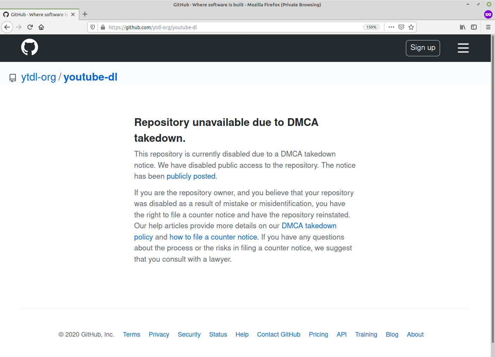
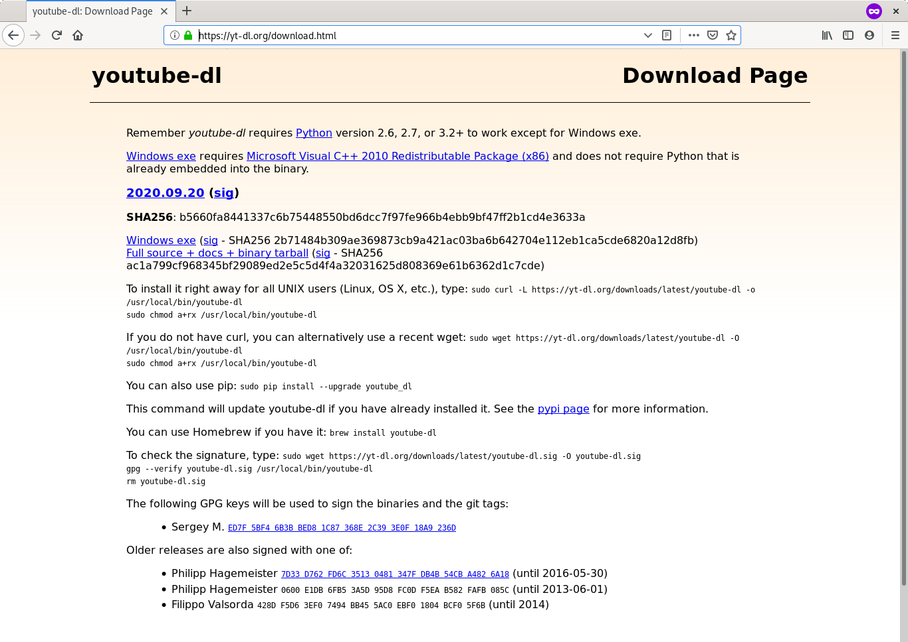

Friday night on the 23rd of October the ‘Recording Industry Association of America, Inc. (RIAA)’ sent a [DMCA request](https://github.com/github/dmca/blob/master/2020/10/2020-10-23-RIAA.md) to GitHub asking that the popular YouTube downloading software ‘youtube-dl’ be taken down. GitHub responded as by immediately removing the repositories and 17 forked pieces of software from it’s site.

Most DMCA notices are regarding the unauthorised distribution of a particular piece of media, and they request that a media be taken down. This DMCA notice was different since it’s targeting tools that can be used to reproduce copyrighted media.

Youtube-DL is licensed under the [Unlicense](https://en.wikipedia.org/wiki/Unlicense), an anti-copyright license that promises ownership of the software to the public domain. As such it is usually considered lawful to freely distribute the software itself. There are many other places you can find copies of this software besides the current maintainers GitHub page.

The notice claimed the youtube-dl software was a ‘Anticircumvention Violation’ as well as a violation of YouTube’s terms of service. It requested that:

_“In light of the above noted copyright infringements and anticircumvention violations, we ask that you immediately take down and disable access to the youtube-dl source code at all of its locations where it is hosted on GitHub, including without limitation those locations in the representative list set forth above.”_

It also draws attention to the examples featured in the youtube-dl source code which include examples of how to download copyrighted music from Icona Pop, Justin Timberlake and Taylor Swift. The notice also claimed that:

_“The clear purpose of this source code is to (i) circumvent the technological protection measures used by authorised streaming services such as YouTube, and (ii) reproduce and distribute music videos and sound recordings owned by our member companies without authorization for such use.”_

Although the youtube-dl software cannot be used to distribute music, only to reproduce it. It’s also possible to use youtube-dl to reproduce public domain or creative commons work that people do have the right to copy and redistribute.

For now the software remains widely distributed and used. It can still be accessed through the [existing yt-dl.org website](https://yt-dl.org/download.html). Last year the RIAA was [able to get 5 YouTube ‘ripper’ sites removed from the Google search engine.](https://torrentfreak.com/riaa-delists-youtube-rippers-from-google-using-rare-anti-circumvention-notices-191108/)

---

## Perthchat News Interview With Philipp Hagemeister

I reached out to previous maintainer Phillip Hagemeister, who had this to say about the incident:

**Are you worried you will see any personal damages from this?**

    I received a cease and desist letter from German lawyers a couple of weeks ago. However, there are a number of technical inaccuracies in that letter; in particular the lawyers did not seem to have understood that my maintainership of youtube-dl ended years ago. Since this is an ongoing legal issue, that's all I'll say about that.

**Are you going to change the examples in the source code and remove references to the copyrighted works of Icona Pop, Justin Timberlake and Taylor Swift?**

    I am no longer involved in the youtube-dl project, but if I were:

    I would remove the test cases. These videos were never fully downloaded anyways; they are automated test cases where the test just downloads the first 10KB, which amounts to a couple of seconds at most. This is certainly fair use, but the project is fully functional without these test cases.

    I would remove the referenced code, even though I believe it to be legal. It's an extremely small part of youtube-dl (which despite the name supports over 1000 other sites apart from YouTube) and not worth the trouble for me. I respect those who argue that the code should remain unchanged though, or that only music videos should be excluded.

**Do you have any other comments about the incident?**

| youtube-dl is very valuable for many purposes: It enables video playback on devices where the web interface is not suitable (e.g. Raspberry Pis), it allows playback for disabled users, it powers research projects which analyze videos, and you can just watch videos when there may be no stable Internet connection. This should be unequivocally allowed and even supported for the good of society, while keeping the ability of content producers to benefit from their creations.

| In my time as maintainer, I declined numerous requests to support piracy sites and DRM-protected content. I can not speak for the project in the last years, but from what I've seen that policy has remained. To me, this is the right policy any legal project should follow.

| In some locations, judges seem to have interpreted the law to be something it does not say. It should be clarified – whether by judges or lawmakers – to what is written down already and was intended: Proper DRM should not be subverted except for archiving purposes, but anything else is clearly allowed. Personally, I would go so far to require DRM schemes to decode timestamp and licenses to enable archiving. That's not to say I think that DRM subversion should be illegal in the first place, but that's a political rather than a legal issue.

| GitHub is in no way to blame. They hosted the project for free, and we should thank them for that. I can understand that some people don't want to deal with the RIAA – maybe they are not even located in the US – and simply move the source code somewhere else, but I greatly appreciate GitHub's services and support. I hope they can work with future maintainer of youtube-dl to get the project back on GitHub.

| My thanks go to everybody who has contributed so far to youtube-dl, but especially to the current maintainer Sergey. I hope somebody takes up the flag, source code, and distribution of youtube-dl, but I understand if Sergey doesn't want to deal with all of this trouble. Due to other personal & open-source commitments as well as the ongoing legal affairs, I'm sad it can't be me. I wish the project all the best.

| Copyright law is always a balance between creators and society. When it comes to being able to watch videos no matter the device or Internet connection, and doing so for non-commercial purposes, the balance we should strive for seems clear to me; it should allow youtube-dl.

---

## Youtube-DL returns to GitHub, a happy ending?

Under fire from the community, GitHub with assistance from the EFF were able to [reverse the DCMA request](https://github.blog/2020-11-16-standing-up-for-developers-youtube-dl-is-back/). You can find a copy of the EFF's letter here.

The EFF argued that the examples of downloading copyrighted works were fair use, and that Youtube's rolling cipher was not being circumvented, since it's not a anti-circumvention feature, and does not prevent users from copying videos.

On November 16th 2020 GitHub reinstated the Youtube-DL repository as well as all the forks that were taken down. GitHub itself has promised to treat future DCMA notices with more scrutiny, and have donated $1 million dollars to their new '[Developer Defence Fund](https://github.blog/2020-11-16-standing-up-for-developers-youtube-dl-is-back/#developer-defense-fund)', which will be used to further review DCMA requests before they are acted on.

For now Youtube-DL seems safe, but the future of this FOSS project and many others still seems dependant on the actions of large companies as well as the law.
